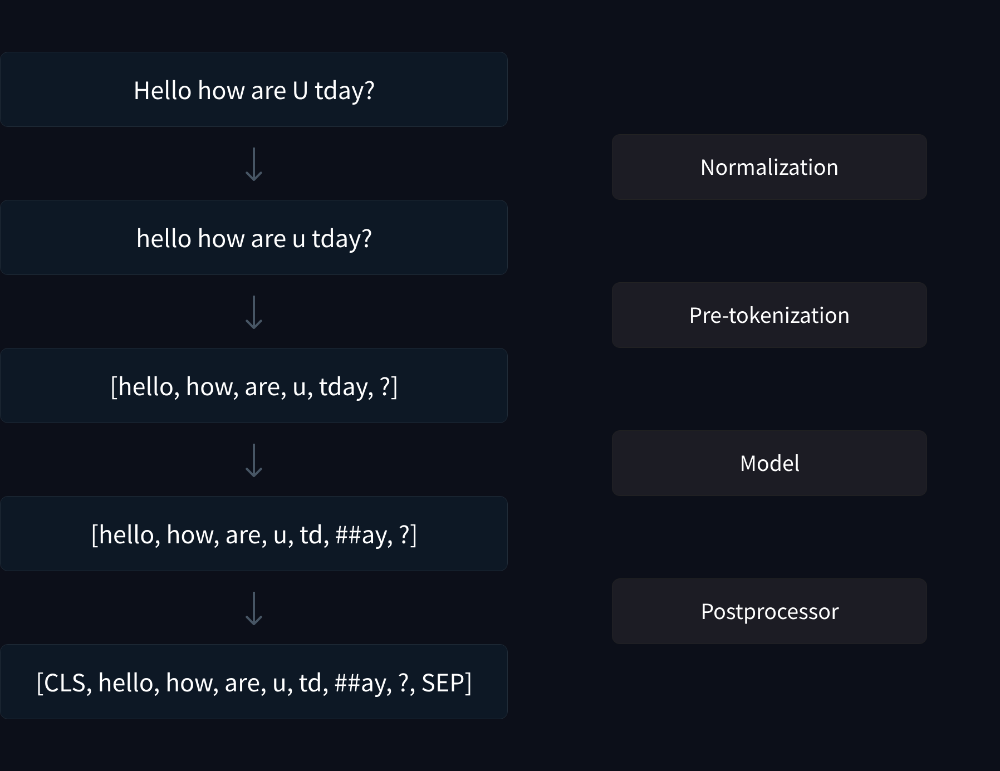

<!-- toc -->

## What does a Tokenizer do?
Let's see a 🤗 tokenizer in action first:
```
from transformers import AutoTokenizer
tokenizer = AutoTokenizer.from_pretrained("gpt2")
print(tokenizer.encode("Let's understand tokens")) 
# Output: [5756, 338, 1833, 16326]
print(tokenizer.batch_decode(encode("Let's understand tokens"))) # convert token ids to tokens
# Output: ['Let', "'s", ' understand', ' tokens']
```
The tokenizer encodes a piece of text into a sequence of _token ids_. These token ids are fed into our neural network. THe neural network has a special layer in the beginning called the _embedding_ layer. Corresponding to each _token id_, the embedding layer stores a unique embedding vector. Given the input sequence of token ids, the embedding layer effectively performs a per-token-id lookup to output a sequence of embedding vectors. Before we get any further, we should ask: What are tokens? How do you decide where to break up a piece of text? What are the different ways in which you can break up text?


## What are Tokens?

In essence, a token is an atomic piece of text. Tokenization/Segmentation of text is the process of breaking up text into smaller, meaningful units. Tokenization as a basic step in natural language processing is very old. These tokens should ideally be _word forms_, or in simple terms, some variation/derivative of a word. Adding some history, the Morphological Annotation Framework (MAF) ISO standard defines typographical units or tokens as  “non-empty contiguous sequence of graphemes or phonemes in a document". The typographic separator we're all familiar with is the whitespace (which _separates_ words), but this is script dependent (Latin, for example, uses whitespace, but the Japanese script does not). Previously, one would have to make a set of arbitrary rules to come up with a mapping between words and tokens. (For example "don't" -> "do n't"). 

> Side note: Morphosyntactic is a fancy way of saying that you are marking up text to indicate various attributes of words, such as their parts of speech, gender, number, case, etc. MAF was a proposal that came up in 2005 (Interesting, you can still find their slides [here](http://atoll.inria.fr/RNIL/Jeju04.pdf)).  A grapheme is the smallest unit of a writing system of any given language. A phoneme is the smallest unit of sound in a language that can distinguish one word from another. There are schools of thought on what constitutes a grapheme and what doesn't, and I don't want to get into that mess here.

As expected, there's quite a bit of history about the evolution of tokenization/segmentation. Initially, this was based solely on meaningful typographic units (for the English language, this would be words and special characters separated by whitespace), and we've now moved towards a more fine-grained, sub-word level. An excellent study from [Mielke *et al*](https://arxiv.org/abs/2112.10508) provides an in-depth look.


## Main approaches to tokenization
Let's quickly go over different kinds of tokenization. The two extremes of tokenization are character and word-based tokenization. In one case, the vocabulary is too small, the splits are too fine-grained, leading to very long tokenized sequences. Further this does not provide enough meaningful language representation for the model to springboard from. With word tokenization, you get meaningful units, but they are *closed-vocabulary* models - they are unable to deal with rare/novel words that weren't seen during training (Out-Of-Vocabulary). Even if you did assemble a gigantic corpus of all possible words, this vocabulary would be too big, too large to deal with, because of the fact that words can contain declinations, punctuations, misspellings, etc. The most popular form of tokenization is the middle ground: sub-word tokenization. The optimal way of breaking down text into different component sub-words is something that is learned from a relevant text corpus. 

With subword tokenization, it is pretty non-trivial to figure out the best way to split words. Notable examples are words such as don't (this is an example of a contraction, where a combination of words `do` and `not` is shortened to don't), or code (an example with type-specific grammar). Further, as you'll see, the statistical nature of tokenization models also gives you weird results - such as numbers 450 and 448 being represented with a different number of tokens. (This is, in essence, a form of overfitting in your tokenizer)

## Popular subword tokenization algorithms
If you're just starting out with learning about different subword tokenization algorithms, [HuggingFace's NLP course](https://huggingface.co/learn/nlp-course/chapter6/1) is a must watch. Their videos have crisp animations that provide a good introduction, and it's very hard to top that in writing. That said, I'll briefly summarize some of the most popular subword tokenization algorithms are:
### Byte-pair encoding (BPE)
 Byte-pair encoding/ digram coding comes from information theory, and was first proposed in 1994 ([Web archive](https://web.archive.org/web/20160326130908/http://www.csse.monash.edu.au/cluster/RJK/Compress/problem.html)). BPE tokenization first performs a character-level tokenization of the given corpus. Then, the most frequent pair of adjacent characters is merged into new, 2-character long tokens and all instances of the pair are replaced by this new token. This process is repeated (now with variable-length tokens, not just characters) until you achieve your desired vocabulary size. At each step, whenever merges happen, the tokenizer records these as "merge rules", to be used post-training while tokenizing a given piece of text.  Going back to the information theoretic meaning, given a text file, you iteratively replace the most consecutive pairs of bytes in your data with an unused byte (a byte that didn't appear in your text file). This is where you get the term "byte pair encoding". (There are, as expected various ways BPE has been used. For example, GPT-2 uses a Byte-Level BPE, where BPE is applied to raw bytes, not characters)

#### Tokenization Post-Training
Given a piece of text, the BPE algorithm first performs a character-level tokenization, and then uses the merge rules used during training to iteratively merge different tokens until you can no longer reduce the tokenized sequence further. The exact time complexity depends on the implementation, but the SentencePiece implementation (which is very popular, and integrated into  🤗 tokenizers) takes $O(NlogN)$, where $N$ is the length of the input sentence.

### WordPiece Tokenization
WordPiece is another popular tokenization strategy, used in BERT, RoBERTa, etc. WordPiece tokenization is very similar to BPE, but it differs in the way the pairs are selection during the merging steps. In the case of BPE, the pairs are ranked simply by frequency, and the most frequent pair is selected each time. With Wordpiece, a custom score is computed for each pair as follows:

score=(freq_of_pair)/(freq_of_first_element×freq_of_second_element)

pairs with the higher score are merged each iteration. By normalizing the frequency of the pair by the individual token frequencies, only those tokens are merged that are already not that frequent in the vocabulary. 

#### Tokenization Post-Training
Given a piece of text, the WordPiece algorithm uses a left-to-right longest match first strategy. (This seems to be linear time processing, I need to dig into implementation though) 

### Unigram Tokenization
Unigram tokenization uses a statistical language model to model token probabilities. The basic assumption made by the unigram model is that the occurence of each word is independent of its previous word (hence, it is a "unigram" language model).  This is of course, not appropriate for any serious model you'd want for generation, but we're looking at tokenization. Compared to BPE, Unigram's training strategy proceeds in the opposite direction: A large vocabulary is iteratively reduced in size by removing certain tokens. The training process can be summarized as follows: you first start with a large vocabulary for example by considering all possible substrings or by training BPE and using it's learnt vocabulary. At each step of the training, the algorithm computes a loss over the training corpus, for the current vocabulary. Then, you reduce the vocabulary size by removing some $x$ percent of tokens that cause the loss to increase the least. 
#### Tokenization post-training
Given a word, we look at all the possible segmentations of that word into tokens and compute the probability of each according to the trained Unigram model. We pick the tokenization/segmentation with the highest probability. Semgentations with more tokens, usually end up with lower total probability (because you multiple more small numbers), and thus the model favours segmentation into smaller number of tokens, similar to what we expect. 


# The Tokenization Pipeline

1. Normalization: Cleaning - lower casing, removing accents, etc 
2. Pre-tokenization: Optional stage of splitting up text into words based on whitespace (if applicable for that language)
3. Model: The tokenization algorithm that takes in text/ list of words and spits out a list of tokens
4. Post-processor : Adds special tokens like sequence separators, beginning and end of sequence tokens, etc

An excellent visualization for the BERT tokenizer, from HuggingFace's NLP course:



## SentencePiece
This is NOT a tokenization algorithm. SentencePiece is a framework for tokenization and detokenization. It is widely used because it has some desirable properties for an end-to-end text processing system, such as being purely data driven and not relying on pre-tokenization steps (i.e don't have to send in text separated by whitespace). It is also language independent, and supports both BPE and Unigram language model algorithms. When you see "a SentencePiece model" in any literature, this is simply referring to the fact that model was trained using the SentencePiece library, and the configuration/ parameters of the model are available via the SentencePiece model abstraction (roughly speaking, this is like saying "PyTorch model", or "model trained with 🤗Trainer"). The tokenization algorithm itself can be BPE (the most likely algorithm) or Unigram (or a custom variant if mentioned.)

## Next Chapter
In the next chapter, we'll dive into the BPE algorithm, and train a simple BPE model from scratch.


## Further reading
- ChatGPT has Never Seen a SINGLE Word (Despite Reading Most of The Internet). Meet LLM Tokenizers: https://youtu.be/uSinkCeUg9U?si=5pVRed3GG0oP8B-b 
- Tokenizers chapter, The HuggingFace NLP course: https://huggingface.co/learn/nlp-course/chapter6/1
- Between words and characters: A Brief History of Open-Vocabulary Modeling and Tokenization in NLP : https://arxiv.org/abs/2112.10508 
- Subword Regularization: Improving Neural Network Translation Models with Multiple Subword Candidates (Unigram):
 https://arxiv.org/abs/1804.10959 
- Neural Machine Translation of Rare Words with Subword Units (BPE): https://arxiv.org/abs/1508.07909 


<!---
Comment on character level tokenization: Mielke et al put it brilliantly: all character-level models need to spell out each word every time it is generated i.e they cannot memoize tokens as resuable units. 

GPT-2 in-fact uses a Byte-Level BPE where BPE is applied to raw bytes. 
-->