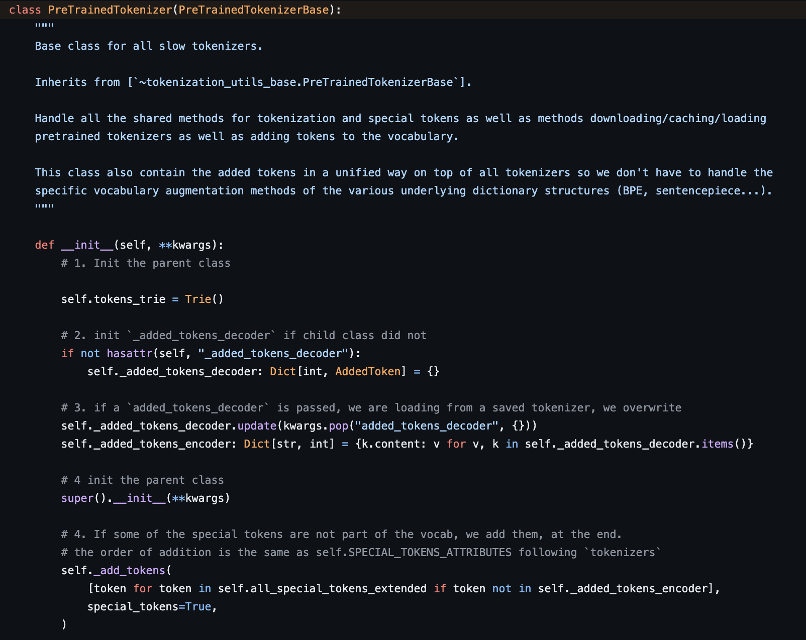

# Diving into the HuggingFace tokenizer
## What makes up a HuggingFace tokenizer?
Well, let's first think about state: what information does a tokenizer need to save? 
### BPE Tokenizer
Let's consider a BPE tokenizer. In HuggingFace, you can save a tokenizer by calling the `save_pretained` method. Typically, you will see the following files for a BPE tokenizer:
- [DEPR] `added_tokens.json`: Part of the older format for saving HF tokenizers. A little hard to figure out what this is for, since we have an "added_tokens" entry in the tokenizer.json file itself. Further, this doesn't actually have all the [AddedTokens](https://huggingface.co/docs/tokenizers/api/added-tokens) of your tokenizer (this inc. special tokens for some tokenizers like DeBERTa, Llama). 
- [DEPR] `merges.txt` : Saved in the older format for BPE tokenizers. Contains a list of BPE merge rules to be used while encoding a text sequence. 
- `special_tokens_map.json`: A dictionary of special token attribute names ("bos_token", etc) and their values ("\<BOS\>") and some metadata. What makes special tokens so special? These are commonly used tokens that are not a part of the corpus but have certain important designations (BOS- beginning of sequence, EOS-end of sequence, etc). All of these special tokens are accesible as attributes of the tokenizer directly i.e you can call `tokenizer.eos_token` for any HF tokenizer, since they all subclass the [`SpecialTokensMixin`](https://github.com/huggingface/transformers/blob/ced9fd86f55ebb6b656c273f6e23f8ba50652f83/src/transformers/tokenization_utils_base.py#L795) class. Maintaining such additional information is a good idea for obvious reasons- none of these are actually a part of your training corpus. You'd also want to add certain special tokens when you encode a piece of text by default (EOS or BOS+EOS, etc). 
- `tokenizer_config.json` : Some tokenizer specific config parameters such as max sequence length the model was trained on (`model_max_length`), some information on special tokens, etc
- `tokenizer.json`: Some notable entries:
    - `add_bos_token`: State for whether to add BOS token by default when you call the tokenizer. Caveats on this later. 
    - `added_tokens`: a list of new tokens added via `tokenizer.add_tokens`. When you call `tokenizer.add_tokens`, the new token added is, by default, maintained as an [AddedToken](https://huggingface.co/docs/tokenizers/api/added-tokens) object, and not just a string. The difference is that an AddedToken can have special behaviour - you might match both " \<ADD\>" and "\<ADD\>" (note the left whitespace) to be the same token, specify whether the token should be matched in a normalized version of the text, etc. 
    - `model`:  Information about the tokenizer architecture/ algorithm ("type" -> BPE for ex). Also includes the vocabulary (mapping tokens -> token ids), and additional state such as merge rules for BPE.Each merge rule is really just a tuple of tokens to merge. Huggingface stores this tuple as one string, space-separated ex: "i am". 
    - `normalizer`: Normalizer to use before segmentation.  
- [DEPR] `vocab.json` : Saved in the older format. Contains a dictionary mapping tokens to token ids. This information is now stored in `tokenizer.json`. 

### WordPiece tokenizer
`raise NotImplementedError`

# Data Structures and Methods
Let's take a look at how a HF tokenizer stores the vocabulary along with the different functionality it provides (as always, these are tightly coupled). For simplicity, I am only going to look into the slow tokenizers, implemented in `python`, as opposed to the fast tokenizers implemented in Rust, as I basically haven't learnt Rust yet (my apologies to the Cargo Cult). Here's what the initialization looks like:



The tokens are stored in a prefix tree/ [Trie](https://en.wikipedia.org/wiki/Trie)! A Trie implementation can vary based on what functionality you want, but these are the important methods in the [HF implementation](https://github.com/huggingface/transformers/blob/d1a00f9dd0b851245e4a54cbd70816a80e781ec2/src/transformers/tokenization_utils.py#L52):
- `trie.add(word)` : Adds a word to the prefix tree.
- `trie.split(text)`: Splits a text as a sequence of valid words (i.e present in the prefix tree) based on a longest-match strategy. 

Okay, so what happens when you do call `tokenizer(text)`? An example with `gpt2`:
```
tokenizer = AutoTokenizer.from_pretrained("gpt2", use_fast=False) # get the slow tokenizer
print(tokenizer("The slow tokenizer")) # Output: {'input_ids': [464, 3105, 11241, 7509], 'attention_mask': [1, 1, 1, 1]}
```
You can see that the result is in fact a dictionary. `input_ids` are the token ids for the input sequence. If you decode the above sequence to get the actual tokens, you get `['The', ' slow', ' token', 'izer']`. Let's look at what happens inside the `__call__` method to get this result. The slow tokenizer class `PreTrainedTokenizer` derives the `__call__` method from the parent class `PreTrainedTokenizerBase`, in which [`__call__`](https://github.com/huggingface/transformers/blob/25b0f2033ba23e354ef2f665764248fcbb3f49ba/src/transformers/tokenization_utils_base.py#L2729) basically parses input arguments to make a call to the `encode_plus` function. HuggingFace tokenizers have two methods for encoding: `.encode()`, which gives you just a list of input_ids, and `encode_plus()`, which returns a dictionary with some additional information (`attention_mask`, `token_type_ids` to [mark sequence boundaries](https://huggingface.co/docs/transformers/glossary#token-type-ids), etc). The `encode_plus` implementation for the slow tokenizer (in reality, this is `_encode_plus`) is as follows:
1. Tokenize input string/strings to get a list of tokens for each input string. This is handled by the `.tokenize()` method.
2. Convert tokens to token ids using `.convert_tokens_to_ids()` method.
3. Send in the token ids and other kwargs to `.prepare_for_model()`, which finally returns a dictionary with `attention_mask` and other keys if needed. 


