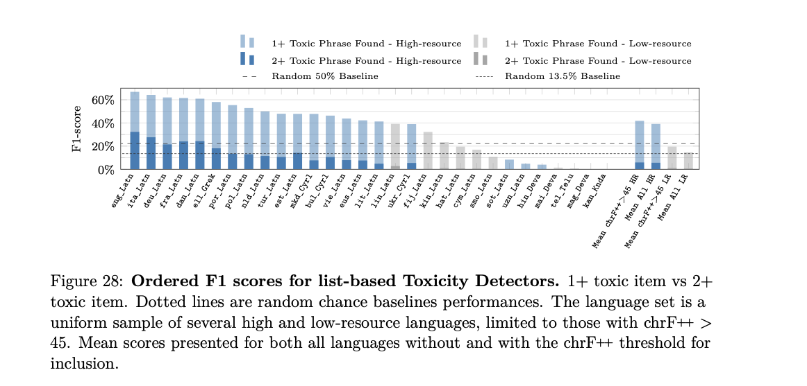

# Number Tokenization

What is an ideal way to tokenize numbers? Well, the main reference we have is the way we represent numbers. In the decimal number system, we assign unique symbols to numbers 0 to 9, and then all other numbers can be represented using these symbols (along with the "." for fractinal parts). So, one expectation you could have is that tokenization should also follow this uniformity (along with a special token for continuity of a number, like "##" for BERT). That is far from the case in practice! Let's take T5, for example. The number "410" gets segmented as one token, but the numbers "411" or "490" are segmented as two tokens, "4" and "11"/ "90". There are a bunch of weird patterns in how many tokens different numbers get. The reason is pretty simple if you think about what BPE does - your training corpus contaiins a bunch of different numbers, and a tokenizer like BPE, while training on this corpus, would try to find the best way to compress all of these numbers. Your training data is likely to contain round numbers more ("400-odd students", "100s of people missing") and so these are likely to get single tokens, and so on. This non-uniform way of 
representing numbers might be nice for compression's sake, but it has some nasty downstream effects. The embedding for two numbers close to each other on the number line can be very different because of almost arbitrary splits for the two numbers (like in the above case for "410" and "411"). Recent models explicitly ensure some uniformity.  For example, with Llama, all numbers are tokenized as individual digits. With Falcon, all numbers from 0-999 are segmented as 1 token, although strangely enough 957 is the only exception that gets 2 tokens (why??). The larger numbers are tokenized using smaller 3-digit/2-digit/1-digit tokens. As far as I can tell, even GPT-4's tokenizer (available in [tiktoken](https://github.com/openai/tiktoken)) does the same: All numbers from 0-999 (inclusive) are present in the vocab and larger numbers get split based on these smaller numbers. 

Further reading:
- LLaMA: Open and Efficient Foundation Language Models: https://arxiv.org/abs/2302.13971 

# Metrics
The differences in text pre-processing/ tokenization schemes can show up in your metrics. A prime example is the aptly named package _sacrebleu_ from [Post _et al_](https://aclanthology.org/W18-6319/) (2018). BLEU (BiLingual Evaluation Understudy) score is a popular metric in NLP for machine-translation. However, the score itself doesn't specify the exact format in which reference and machine-translated text are compared, and thus different users use their own tokenization and normalization schemes. There can be significant differences across such formats, with Post _et al._ showing that the changes can be as be as high as 1.8 (which could be the difference between your model being state-of-the-art or not).

Further reading:
- A Call for Clarity in Reporting BLEU Scores: https://aclanthology.org/W18-6319/

# Tokenization for non-English languages

Being able to process text in more than one language is an essential component of many NLP applications. For example, Whisper, OpenAI's speech-to-text model (which is a plain old encoder-decoder transformer model) [can process English and Chinese speech flawlessly](https://x.com/jeremyphoward/status/1721696652506100175?s=20). Of course, this is not a plain text-in -> text-out application, but the point is that tokenization in other languages, especially low-resource languages comes with it's own set of challenges. The first, and probably biggest challenge is lack of high-quality training data for many languages. Languages like English, Chinese, Russian, etc have a lot more content available on the internet than say, Kannada and Swahili. There are also fundamental differences across languages, such as the absence of a typographic separator (Ex: a whitespace in English) in some languages like Chinese and Japanese. Some languages also have complex script rules, specifically with how consonents and vowels combine. In Kannada, for example, the word for 'language' is ಭಾಷೆ. ಭಾ is a combination of the consonant 'ಭ' and the vowel sign 'ಾ'. You would want a tokenizer that recognizes ಭಾ as a meaningful unit and a distinct token, and doesn't break it down further into consonant and vowel signs.  

# Tokens for Multilingual models

Firstly, how do you build a multilingual system? If you're building a machine-translation model, then one approach can be to learn one tokenizer per language. For example, you can imagine an encoder-decoder transformer trained to translate English to French. In this case, your input text will be tokenized and numericalized based on, say, a BPE tokenizer trained on English text. You would retrieve the appropriate embeddings for each token, pass it through the Transformer. At the decoder's output, you select the most probably class/ID for each position in the output sequence, where IDs are based on the vocabulary of a BPE tokenizer trained in French. When decoded tokens are fed back into the decoder, you make use of a different, output embedding layer that maps decoded tokens to embeddings which are passed to the decoder.

Of course, one would want to build multilingual models that can translate between a lot more than 2 languages (and more than just 1 way translation). In this case, a simple approach would be to mix all available data for all the languages. The problem with this is that there is always significant disparity in the amount of data you have for each language. This disparity shows up in the number of tokens dedicated to each language in the vocabulary (i.e very low data -> close to character-level tokenization). Issues with complex script rules also hurt performance. Let's now look at one paper which built a massive multilingual system, and the world of multilingual tokens. 

## No Language Left Behind

[No Language Left Behind (NLLB)](https://ai.meta.com/research/no-language-left-behind/) was a massive effort from Meta AI to improve machine translation models for low-resouce languages. This is the first time we crossed the 200 language count in terms of datasets and models available. Key contributions include new datasets, models and benchmarks, focusing on languages never targeted at scale before. To break this down, they first conducted surveys of native speakers in different low resource languages to understand their needs reg. machine translation, then developed an automatic data generation pipeline focusing on said languages. They utilized smart data mining techniques (essentially, an improved version of [bitext mining](https://paperswithcode.com/task/cross-lingual-bitext-mining)) to collect quality training data. Using this mined data along with human-translated seed data, they trained multilingual Mixtures-of-Experts models.

The full NLLB paper is 192 pages long! Needless to say, even a good summary of their contributions is going to be pretty long. Let's get back to our centre of discussion: tokenization. 

### Why tokenization matters
Well, how did they train their tokenizer, given that you're dealing with this extremely disproportionate amount of data per language? Here's a snippet from page. 91 of the paper:

> ....we trained a new SentencePiece model....To train this SentencePiece model, we sample a total of 100M sentences from primary bitext corpora. Given that most of the languages in NLLB are low-resource languages (150), uniform sampling would over-represent high-resource languages and under-represent low-resource languages, leading to too much fragmentation of low-resource language text. To mitigate this, we apply temperature sampling (with temperature T = 5), which effectively downsamples high-resource languages and upsamples low-resource languages. This results in a more balanced distribution of samples over all languages.

#### How does temperature sampling help again?
Here's a quick refresher! Consider the case with 2 languages $En$ and $Kn$, with 1000 examples and 100 training examples respectively. With uniform sampling for the combined dataset, here are the probability that a random example belongs to a given language: 
 $P(En) =  1000/1100 \approx 91\%$ and $P(Kn) =  100/1100 \approx 9\%$. Now with temperature sampling with T=5, you get 

$P(En) = \dfrac{(1000)^{1/5}}{(100)^{1/5} + (1000)^{1/5}} = 61.31\%$

$P(Kn) = \dfrac{(100)^{1/5}}{(100)^{1/5} + (1000)^{1/5}} = 38.69\%$

​You can clearly the difference! Of course, when you've got a mixture with 200 languages with many of them low-resource, you will still have some im-balance. The idea of over-sampling low-resource languages to get a more balanced vocabulary is certainly not new. But I find it interesting that even at the scale of 200 languages, all you need (or all we know of?) is temperature sampling. 
 
### Tokenization affects evaluation
Another interesting side effect of poor tokenization from the paper: lower performance on toxicity detection. In NLLB, they evaluated their machine-translation system by trying to do toxicity detection on the translations. I don't want to bloat this section up by too many details, so here's the gist. Toxicity detection is important for a translation system, because *added toxicity* terms, i.e., translated content containing toxic words that were *not* present in the original text is (1) bad/low-quality transation (2) degrades user trust in the system(Like translating "I'm bad at this" to "Ich bin scheiße darin"/ I'm shit at this ). So, the main purpose here is:
> ...to improve translation safety through minimizing the probability of catastrophic mistranslations

The pipeline for a language like Hindi looks as follows :
English text -> Translation Model -> Hindi tokens -> Hindi text -> Exact match vs a list of known toxic words. 

The results for different languages is given below (the details don't matter for this discussion; just note that smaller numbers mean worse performance, and observe which languages perform worse).

Here are the authors' comments on the languages with poor performance:

> The results for the languages with the lowest performance in Figure 28, i.e., Hindi (hin_Deva), Kannada (kan_Knda), Maithili (mai_Deva), Telugu (tel_Telu), and Magahi (mag_Deva), may be partially explained by the fact that the scripts in which these languages are written are not always adequately tokenized by our detectors.

While tokenization might not be the sole reason, it's important to note how "poor" tokenization can affect *everything*. Another question to think about is: What's special about these specific languages (and that too all Indic?) ? Well, many Indic languages have complex script rules in ways that different consonants and vowels fuse together to change gender, tense, mood, plurality, etc. Typically, tokenizer vocabularies are not large enough to adequately represent various meaningful units in these languages and fine-grained tokenization can lead to a loss of information.

# Low Resource => More Costly
One artifact of having an imbalanced mixture of different languages in your training corpus (for the tokenizer) is that your costs for text completions in low-resource languages can shoot up - simply because the text sequences get encoded with more tokens (i.e there is lesser _compression_ since a _smaller_ part of the vocabulary is _allocated_ for that language). For example, one user found that API calls in Hindi are 8 times more expensive than those in English: https://www.reddit.com/r/OpenAI/comments/124v2oi/hindi_8_times_more_expensive_than_english_the/

.. https://github.com/gordicaleksa/Open-NLLB

https://arxiv.org/pdf/2204.08832.pdf 