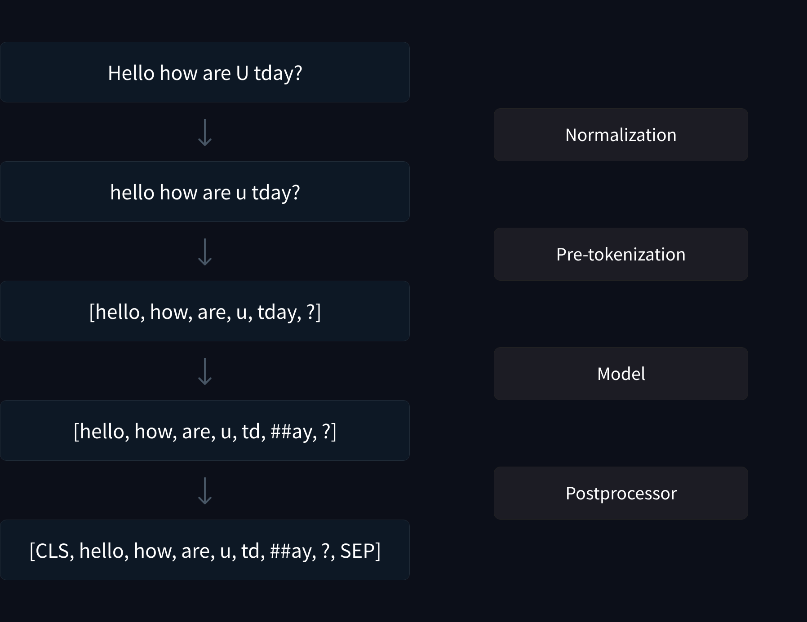

# Applying what we've learned

## INput Preprocessing
This is different for different tasks: you'd want to add special tokens for intrsuction tuning, not for causal language modelling, where you typically chunk your data. 


## Tokenizer Puzzle 1: White spaces matter
Here's a simple puzzle to test your knowledge of tokenization. Consider the case where you have a sequence of English words all stuck together i.e whitespace between them has been removed. Here's a sample:

```
Myfirsttokenizerpuzzle
```

The question is:
> Can you recover the original words without whitespace?


This is, in general, ill-posed, but let's say that in the case we're interested in, there is only one possible set of words. This is a modification of [Leetcode-style questions](https://leetcode.com/problems/word-break/) you might have seen. The focus here is, of course, to get a better understanding of tokenization. So, the natural question is: what if you tokenize the sequence? What do you end up with?

Let's use the BERT tokenizer, because you can clearly see the difference with and without. We get:

```
['My', '##fi', '##rst', '##tok', '##eni', '##zer', '##pu', '##zzle']
```

Here "##" denotes that this is infact a continuation from the previous token. If you had spaces ("My first tokenizer puzzle"), you'll see

```
['My', 'first', 'token', '##izer', 'puzzle']
```

You can clearly see the differences with and without whitespaces. In general, the sequence lengths can vary a lot with and without spaces. This is because the tokenizer sees one giant chunk of text, and in fact a large word it hasn't seen before. WordPiece uses a left-to-right longest-match first strategy to find the longest tokens to span the full length of the given text. This is different from the case with whitespaces. To better see the differences between the two cases, let's visit the full tokenization pipeline:



The image above is from the [🤗 NLP course](https://huggingface.co/learn/nlp-course/chapter6/4), showing the full pipeline for the uncased BERT tokenizer (which is why normalization converts everything to lower case). With our example, let's see what happens at each stage:

```
        Myfirsttokenizerpuzzle
                ↓········································(Normalization)
        Myfirsttokenizerpuzzle
                ↓········································ (Pre-tokenization)
[('Myfirsttokenizerpuzzle', (0, 22))]
                ↓········································ (Model/Tokenization)
['My', '##fi', '##rst', '##tok', '##eni', '##zer', '##pu', '##zzle']
```

```
        My first tokenizer puzzle
                ↓ ········································(Normalization)
        My first tokenizer puzzle
                ↓ ········································ (Pre-tokenization)
[('My', (0, 2)), ('Ġfirst', (2, 8)), ('Ġtokenizer', (8, 18)), ('Ġpuzzle', (18, 25))]
                ↓ ········································ (Model/Tokenization)
['My', 'first', 'token', '##izer', 'puzzle']
```

I've omitted post-processing here. You can see that the normalization step in this case did not change anything (I believe for BERT-cased, even extra whitespaces, etc are preserved, but, for example, tabs are converted to whitespaces, so it's not exactly doing nothing). The pre-tokenization step, the words are split based on whitespace, but the information is preserved in the tokens by adding a unicode symbol Ġ. In this case, the output also contains _offset mappings_ : these are the the offsets from the start of the text for the token boundaries. Looking at our example without whitespaces you can see that there's really nothing happening in the normalization and pre-tokenization step (which will be true for most modern tokenizers like Llama and GPT4). You can clearly see the difference in the inputs to the WordPiece model. After pre-tokenization (post-pre-tokenization?), the WordPiece will find the best (rather longest) match for the list of words. Note that, with sub-word tokenizers, this is usually tokens that are sub-words , but it could well be a _multi-word token_ ("i am" is a popular enough phrase that has a special token in GPT-2 and LLama's vocabulary, for example). So, now that we've gone through the tokenization pipeline for the two cases, let's come back to the original question:

> Can you recover the original words without whitespace?

You can see that that the tokenizer gives 8 vs 5 tokens for the two cases (without spaces and with spaces, resp.). Clearly, finding a mapping between these two tokenized sequences is non-trivial in general. The one thing that you can say is that a good _sequence encoder_ model should place both these sequences very close together in the embedding space. Do you see where I'm going with this? One answer to the problem, of course, would be to build a dictionary with as many English words as possible (we need to deal with all possibilities with special characters, punctuations, etc) and then have some optimized dynamic programming strategy (because this is ill-posed, with multiple solutions in general, and many answers/splits won't be grammatically sound). But the best answer for the problem is to feed the sequence into a language model! A powerful-enough language model will be pretty much flawless in recovering the original words. 


## Tokenizer Puzzle 2: The Effect of Vocabulary Size

Inference and Training speed/throughput are often reported in tokens/ sec. However, the number of tokens in a model's vocabulary can differ widely - GPT 2 has a 50k vocab size, Llama 2 has a 32k vocab size, and GPT4 has a whopping 100k vocab size. This means that comparisons based solely on token counts might not make sense. You might ask: How _exactly_ does this affect sequence length: Are there heuristics to predict sequence lengths based on vocab sizes or other data? Well, that's a very hard question. Firstly, a lot of current tokenizers are BPE-based, so let's say we're only looking at BPE tokenizers. Now, vocabulary sizes are _chosen_ while training tokenizers. But vocab size is not the only component here. One training corpus might include a lot of code, and thus the vocabulary would have a bunch of code-specific tokens, while another might include very little, and you might end up with only character-level tokens for code. With such variability, it's not easy to just look at vocabulary size and say that for this data, I will get x times more tokens with LLama 2 vs GPT4. Indeed, you can see the same from [Thomas Wolf's tokenizer puzzle](https://twitter.com/Thom_Wolf/status/1700812382392516936):

> Sunday small guessing puzzle
> Let's say I have 3 tokenizers:
> - llama2: 32k vocab
> - falcon: 65k vocab
> - GPT4: 100k vocab  

> I take ~2M random documents from the web  
> (let’s say 10 random parquet files from RefinedWeb from https://huggingface.co/datasets/tiiuae/falcon-refinedweb roughly 1B tokens). I tokenize them with the tokenizers.
> What will be the relative fertilities of these 3 tokenizers? ie. how many more tokens with falcon and llama2 versus gpt4 for instance would you expect. And why does this matter?

A general heuristic is that a bigger vocab will lead to fewer tokens. Having more tokens means that longer character sequences might get represented with the additional tokens present, and you can get a shorter overall sequence length using the additional token ids. With BPE, you can simply say that you're definitely making more merges, and thus overall sequence length reduces (Of course, there is some more nuance here - you need to have more tokens dedicated for the given domain/ corpus you're dealing with).

Here's the [answer](https://x.com/Thom_Wolf/status/1701206627859206450?s=20): 
> Running on 1B tokens from the RefinedWeb dataset. 
> - GPT4 tokenizer (100k vocab) gives you 0.997B tokens 
> - Falcon tokenizer (64k vocab) gives you ~5% more tokens (1.04B)
> - Llama2 tokenizer (32k vocab) gives you ~20% more tokens (1.18B)

These numbers are... definitely non-trivial to see. Notice that the absurdly large differences in vocab size do not get reflected as much in the number of tokens. Of course, one would have to go through GPT4's vocab to see what the representation for different data domains (code? other languages?) are like. For example, if the difference between Falcon and Llama2 tokenizers are that the extra tokens in Falcon's vocab were all for code, then you shouldn't expect to see a big difference in tokenized sequence length when you use a corpus of English text. To test this out, let's try this: We'll use a small corpus of plain English text - what better source than Paul Graham's essays - and see the differences in number of tokens. 

The script `paul_graham_essay_scraper.py` will scrape all the text from Paul Graham's essays. I'm not adding the processed, combined plain text file with all essays since that file is large, but this is a small peak at what it looks like:

```
February 2007A few days ago I finally figured out something I've wondered about
for 25 years: the relationship between wisdom and intelligence.
Anyone can see they're not the same by the number of people who are
smart, but not very wise.  And yet intelligence and wisdom do seem
related.  How?What is wisdom?  I'd say it's knowing what to do in a lot of
situations.  I'm not trying to make a deep point here about the
true nature of wisdom, just to figure out how we use the word.  A
wise person is someone who usually knows the right thing to do.And yet isn't being smart also knowing what to do in certain
situations?  For example, knowing what to do when the teacher tells
your elementary school class to add all the numbers from 1 to 100?
[1]Some say wisdom and intelligence apply to different types of
problems—wisdom to human problems and intelligence to abstract
```

It's definitely not cleaned up (wrt separators, random new lines, etc), but it'll do. Locally, once you run 
```
python paul_graham_essay_scraper.py
```
You'll have a `all_pg_essays.txt` file. Then, run

```
python get_token_counts.py
```

To get the following counts (I've added GPT2 as well, because why not):

```
Number of tokens for GPT2: 716928 (716K)
Number of tokens for GPT4: 697456 (697K)
Number of tokens for Llama: 791441 (791K)
Number of tokens for Falcon: 732809 (732K)
```
The vocab sizes for GPT2, GPT4, Llama and Falcon are 50K, 100K, 32K, 64K respectively. You can see the trend in number of tokens follow the inverse of vocab sizes roughly: LLama > Falcon > GPT2 > GPT4. The exact details of merges (all are BPE tokenizers), the training corpus used, as well as the nature of the test corpus used, etc can affect the numbers you see. ( Paul Graham's essays certainly differs in characteristics from datasets like CommonCrawl which are used to train these tokenizers). But you can see that the numbers are actually very close to each other! If all of the extra tokens in GPT-4 were dedicated for English text, then you would definitely see a much bigger decrease in number of tokens. 


## Testing on code
Let's now look at the number of tokens produced for a dataset of code. We'll look at the Stack dataset, and just just about 1.5GB of data (5 files from the python subset). If you wish to try this out locally, run 
```
python get_stack_subset.py
``` 
This will download a subset of the Stack dataset and then tokenize the data using GPT2, GPT4, LLama and Falcon tokenizers. The results are below:
