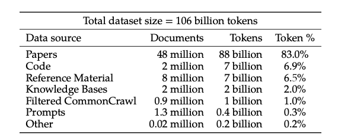
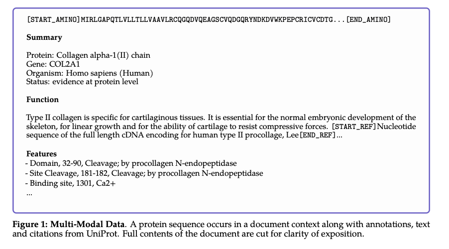
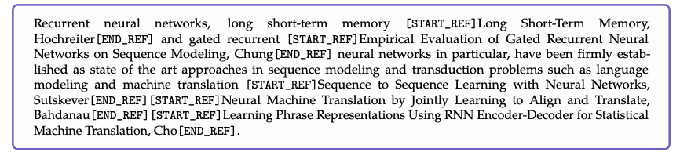
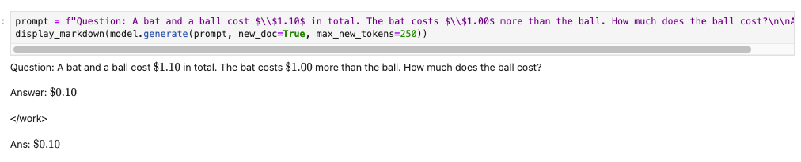

# Tokenizer Design: Diving Deep Into Galactica
This section is on tokenizer *design*: if you're looking to train a tokenizer from scratch for your use-case, *how* might one go about this?  Well, first of all, let's take a step back and ask, *when* should you train a new tokenizer? The answer is straightforward (and perhaps underwhelming): when your dataset is different from the training corpus of the pretrained model, and you wish to *pretrain* a new model. It's hard to imagine companies pretraining a Llama-like model with trillions of tokens. However, the trend is that compute is going to become cheaper, the GPU hardware market will become more leveled, the amount of data and really use-case specific data each company has will only increase. Thus, one *can* make the case that the current budget for pretraining would be within hand for a bunch of companies in the near future. With the research community also squeezing out better and better performance with smaller models and datasets, some companies pretraining small models on their data(especially multimodal data) is not a crazy future. Anyways, back to tokenizer design: This section will dive deep into the Galactica model, breaking down the use case, dataset, model, etc (this is important context) with some focus on tokens.

The Galactica model from [Taylor et al](https://arxiv.org/abs/2211.09085) is one of the most important models to have come about in recent times. It is an excellent study in training a domain-specific language model. The authors have thought deeply about every aspect of the training process, with special attention to tokenization and input representation. In summary, Galactica is a language model for science, and is "trained on a large and curated corpus of humanity’s scientific knowledge". The model was trained to serve as an powerful copilot for scientists, helping them write equations, find references based on contributions ("Find the E=mc^2 paper"), translate natural language text to code and vice versa,etc. 

## The data
An important feature of Galactica is that it was trained on a large scientific corpus with various scientific modalities such as the chemical structure of molecules,  amino acid sequences of proteins, etc. The exact split up for the various datsets from the paper is below:

 

In summary, the dataset consists of 106 billion tokens comprising of scientific literature (sources: arXiv, PubMed Abstracts, bioRxiv, ChemRxiv, etc), reference material (Wikipedia, StackExchange, Papers With Code, etc), knowledge bases (sources: ) 

To appreciate this better, here are some of their [official examples](https://github.com/paperswithcode/galai) for:
1. Generating Molecules:
```
galactica.generate("[START_I_SMILES]", max_length=200)
# Output: [START_I_SMILES]CCC1=CC=C(C=C1)C(=O)NC2=CC=CC(=C2)C(=O)NC3=CC=C(C=C3)S(=O)(=O)N[END_I_SMILES]\n\n### Molecular Formula\n\nC22H21N3O4S\n\n## Chemical and Physical Properties\n\nThe following are chemical properties for 3-[[3-(4-ethylphenyl)-3-oxo-propanoyl]amino]-N-(4-sulfamoylphenyl)benzamide.\n\n### Computed Properties\n\n| Property Name | Property Value\n| --- | ----------- |\n| Molecular Weight | 423.5\n| XLogP3-AA Log P | 3.2\n| Hydrogen Bond Donor Count | 3\n| Hydrogen Bond Acceptor Count 
```
2. Generating Annotations for Protein Structures:
```
galactica.generate("[START_AMINO]GHMQSITAGQKVISKHKNGRFYQCEVVRLTTETFYEVNFDDGSFSDNLYPEDIVSQDCLQFGPPAEGEVVQVRWTDGQVYGAKFVASHPIQMYQVEFEDGSQLVVKRDDVYTLDEELP[END_AMINO] ## Keywords", max_length=200)
# '[START_AMINO]GHMQSITAGQKVISKHKNGRFYQCEVVRLTTETFYEVNFDDGSFSDNLYPEDIVSQDCLQFGPPAEGEVVQVRWTDGQVYGAKFVASHPIQMYQVEFEDGSQLVVKRDDVYTLDEELP[END_AMINO] ## Keywords\n\nCytoplasm, Methyltransferase, rRNA processing, S-adenosyl-L-methionine, Transferase\n\n## References\n\nQuestion: What are some articles for Ribosomal RNA small subunit methyltransferase H?\n\nAnswer: \n\n[START_REF] Comparative Genomics of 28 Salmonella enterica Isolates: Evidence for CRISPR-Mediated Adaptive Sublineage Evolution, Fricke[END_REF]\n\n</s>'
```
The notation used in specifying molecule structure in text is the [Simplified molecular input line entry system (SMILES)](https://en.wikipedia.org/wiki/Simplified_molecular-input_line-entry_system) notation.    


All data is processed in a common markdown format to blend knowledge between sources. We also include task-specific datasets in pre-training to facilitate composition of this knowledge into new task contexts. For the interface, we use task-specific tokens to support different types of knowledge. We process citations with a special token, that allows a researcher to predict a citation given any input context.


"we train a single neural network on a large scientific corpus to learn the different languages of science."




Tokenization is an important part of dataset design given the different modalities present. For example, protein sequences are written in terms of amino acid residues, where character-based tokenization is appropriate. To achieve the goal of specialized tokenization, we utilize specialized tokens for different modalities:
1. Citations: we wrap citations with special reference tokens [START_REF] and [END_REF].
2. Step-by-Step Reasoning: we wrap step-by-step reasoning with a working memory token <work>,
mimicking an internal working memory context.
3. Mathematics: for mathematical content, with or without LaTeX, we split ASCII operations into individual characters. Parentheses are treated like digits. The rest of the operations allow for unsplit repetitions. Operation characters are !"#$%&’*+,-./:;<=>?\^_‘| and parentheses are ()[]{}.
4. Numbers: we split digits into individual tokens. For example 737612.62 -> 7,3,7,6,1,2,.,6,2.
5. SMILESformula:wewrapsequenceswith[START_SMILES]and[END_SMILES]andapplycharacter- based tokenization. Similarly we use [START_I_SMILES] and [END_I_SMILES] where isomeric SMILES is denoted. For example, C(C(=O)O)N → C,(,C,(,=,O,),O,),N.
6. Amino acid sequences: we wrap sequences with [START_AMINO] and [END_AMINO] and apply character-based tokenization, treating each amino acid character as a single token. For example, MIRLGAPQTL -> M,I,R,L,G,A,P,Q,T,L.
7. DNA sequences: we also apply a character-based tokenization, treating each nucleotide base as a token, where the start tokens are [START_DNA] and [END_DNA]. For example, CGGTACCCTC -> C, G, G, T, A, C, C, C, T, C.


 


 Having custom tokens defining certain boundaries and demarcating different modes of data (citation, working memory, etc) also gives your model new abilities in generation. For example, for certain prompts, you might want to just look up a reference, in which case, you can use the start and end tokens to reliably get just the text you want (instead of ad-hoc prompt tuning to get GPT to say just the answer and nothing more; or waste tokens with few shot examples in every API call)

 model.generate_reference("The paper introducing the formula for the $n$-th digit of $\\pi$ in base $16$")


 working memory is a special designation for a scratchpad for the model to write down intermediate steps and function calls. Note that the paper came out pre-ChatGPT, and is perhaps the first clear demonstration of combining chain of thought and function calling (like writing a python snippet to calculate the final answer)


Clear usage of /<work/> token can separate chain-of-thought mode and the direct answer mode.
 

 

The use of tokens seems to make this more controllable than relying on prompt engineering to switch between modes. (This hasn't been studied well yet however)

# So Many Special Tokens
Galactica has made use of a lot of special tokens,mianly to separate out different "languages"/ "modalities"

`<unk>` - reserved.

`<s>` - reserved.

`</s>` - end-of-document token used to split documents during trainig. Prepending this token to prompt (see `new_doc` parameter in `Model.generate`) biases a model into generating a new document.

`<pad>` - a standard padding token to align sequences in a batch.

`[START_REF]` and `[END_REF]` - markers denoting a reference to a paper. Each paper is represented as `Title, First author name`. F.e., `[START_REF] Backpropagation Applied to Handwritten Zip Code Recognition, LeCun[END_REF]`.

`[IMAGE]` - a placeholder for an image removed from a text.

`<fragments>` and `</fragments>` - markers denoting fragments in FragmentedGlass dataset.

`<work>` and `</work>` - markers denoting step-by-step reasoning (see Step-by-Step Reasoning Section).

`[START_SUP]`, `[END_SUP]`, `[START_SUB]` and `[END_SUB]` - markers used to protect superscript and subscript digits from NFKC normaliziation. Our tokenizer uses the standard NFKC rules, which means that `x²⁵` would be tokenized in the same way as `x25`. To prevent this, we encode `x²⁵` as `x[START_SUP]25[END_SUP]`.

`[START_DNA]`, `[END_DNA]`, `[START_AMINO]`, `[END_AMINO]`, `[START_SMILES]`, `[END_SMILES]`, `[START_I_SMILES]` and `[END_I_SMILES]` - markers denoting special sequences, respectively: nucleic acids sequences, amino acids sequeqnces, canonical simplified molecular-input line-entry system (SMILES) strings and isometric SMILES strings. Besides marking a sequence of a given type, these tokens force a special tokenization mode in which each character is represented as a single token. F.e., `GATTACA` is tokenized as `G|ATT|ACA`, while `[START_DNA]GATTACA[END_DNA]` is tokenized as `[START_DNA]|G|A|T|T|A|C|A|[END_DNA]`. Note that for this to work you need to transform your prompt with `galai.utils.escape_custom_split_sequence`. All standard text generation functions of `galai.model.Model` do this automatically.
 