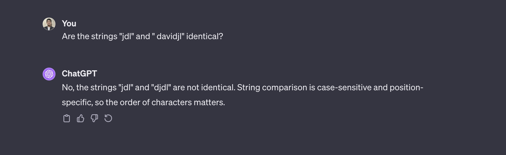

# Table of Contents

<!-- toc -->

- [The PostProcessor: Be careful with special tokens](#the-postprocessor-be-careful-with-special-tokens)
  * [What is your task?](#what-is-your-task)
  * [Causal language modelling](#causal-language-modelling)
  * [Instruction-tuning](#instruction-tuning)
    + [Is this code snippet correct?](#is-this-code-snippet-correct)
  * [What's so special about the EOS token anyway?](#whats-so-special-about-the-eos-token-anyway)
  * [More on special tokens](#more-on-special-tokens)
- [Modifying the tokenizer](#modifying-the-tokenizer)
- [Glitch Tokens](#glitch-tokens)
- [Tiny Tokenizers](#tiny-tokenizers)
- [Next Chapter](#next-chapter)

<!-- tocstop -->

# The PostProcessor: Be careful with special tokens
One aspect we didn't get into until now was the postprocessor: typically, certain special tokens are added at the beginning or end (or both) of your sequence. For example, if you encode "Hello there!" with BERT, you get:

```
['[CLS]', 'Hello', 'there', '!', '[SEP]']
```

With T5, you get:

```
['Hello', 'there', '!', '</s>']
```
Here, `</s>` is the EOS token. If you do the same with Llama, you get:

```
['<s>', 'Hello', 'there', '!']
```

Here, `<s>` is the BOS token. Well, why are there such differences between different tokenizers, even though you're just doing the same `tokenizer.encode()` call? 

## What is your task?

The difference in default behaviour is simply because of the task each model was trained on, and of course the settings for special tokens used (T5, for ex, doesn't use a BOS token).

BERT is a encoder for which the CLS token acts as a start-of-sequence token (and for classification tasks, the hidden state produced for this token is used as the sequence embedding). The SEP token (`tok.sep_token`) serves as the separator between two sequences/sentences as well as an end-of-sequence token. For example, for predicting entailment on the [RTE dataset](https://huggingface.co/datasets/glue/viewer/rte), your input would look like `[CLS] sentA [SEP] sentB [SEP]`.

For the task of causal language modelling, you're working with autoregressive models like Llama. Fundamentally, what it is that you want? You provide an input prompt to a Llama model, and you expect your Llama to provide a good completion to your prompt by autoregressively generating next tokens. When you see this, it becomes obvious why the default behaviour should not include the EOS token: you are looking for a completion of the current sequence of text, and the last thing you want to do is add an end-of-sequence token here! 

Thus, you have different behaviours depending on the pre-training task and the specific model. That said, let's take a look at what you want to be doing during _fine-tuning_. I'll only cover two popular cases: causal language modelling and instruction-tuning.

## Causal language modelling

Here, for each element/ piece of text in your dataset, you would want to add an EOS token at the very end. Note that when you chunk your data, you do NOT want to be adding EOS tokens for every output chunk! 

## Instruction-tuning
With instruction-tuning for sequence-to-sequence models, the postprocessing is simple enough: encode input prompt and expected response individually with the tokenizer. However, with causal language models, we have an extra-step: We concatenate the prompt and response together and then pass that through the model. What do we want here? Well, causal language models are training to be blabbering machines, so we should definitely add an EOS token at the end of the response. 

### Is this code snippet correct?
Here's a small snippet of code I'm writing and testing with the GPT2 tokenizer, for preprocessing a text-based classification dataset:

```
from transformers import AutoTokenizer
input_prompt = "Tweet text : @HMRCcustomers No this is my first job. Label: "
label =  "neutral"
tokenizer = AutoTokenizer.from_pretrained("gpt2")
concat_seq = tokenizer(input_prompt)["input_ids"] + tokenizer(label)["input_ids"]
concat_seq_decoded = tokenizer.decode(concat_seq)
print(concat_seq_decoded)
# Output - "Tweet text : @HMRCcustomers No this is my first job. Label : Neutral"
```
This code snippet seems to perform correctly for GPT2. But is this right? No! Conveninent abstractions can unfortunately hide bugs in your code. If you run the same code for `meta-llama/Llama-2-7b-hf`, you get `<s> Tweet text : @HMRCcustomers No this is my first job Label : <s> Neutral`. With some models, the BOS and EOS tokens are the same, so this becomes a dangerous bug then. What we should do is to simply encode the strings _without postprocessing_ (use `add_special_tokens=False` with 🤗 Tokenizers) and then postprocess the string ourselves. (I came across this bug first in a 🤗 PEFT example, which led to this PR [here](https://github.com/huggingface/peft/pull/926))

## What's so special about the EOS token anyway?
What is it that makes the EOS token special? Sometimes, it almost seems like the EOS token is magical, almost like a bad no-no word you should use with caution. The simple fact is that every special token is special because of it's designation during training. Let's look at causal language models. With the EOS token, it is special because it acts as a separator between documents. Thus, the presence of an EOS token means that the next token should likely be the start of a new document or topic (like "The"). Thus, if the model encounters an EOS token in the _middle_ of your text, you're fighting against the model's pre-training and asking it to output a _completion_ to the _preceeding_ token, while in pre-training it is conditioned to start afresh and "forget" the preceeding text. That is all, really. It's not even that performance will completely drop if you use this EOS token in weird places - it is just that performance will be a bit worse.


## More on special tokens
Special tokens are also widely used in machine translation. Typically the target language or both the source and target language are provided as a special token to the model at hte start of the input sequence. For example, in Google's seminal paper on multi-lingual Neural Machine Translation (NMT), they preprocess each input sequence by adding the token for the target language (ex: "<2es>" for Spanish) at the beginning.

**Further reading**

Google’s Multilingual Neural Machine Translation System:
Enabling Zero-Shot Translation:  https://aclanthology.org/Q17-1024.pdf 


# Modifying the tokenizer
When would you modify the tokenizer? We've already seen one way to modify a tokenizer with `tokenizer.add_tokens`. You have two options with a 🤗 tokenizer:
1. Add a fixed set of _known_ tokens via `tokenizer.add_tokens`
2. _Learn_ a _new_ set of tokens via `tokenizer.train_new_from_iterator` 

Option 1 is a bit ad hoc, and you can do this when you're probably experimenting with a new special token. Or, you're finetuning your model on this new dataset which has a fixed set of output words, and adding these words to the tokenizer would help. Note that modifying the tokenizer is only one part of the story. When you modify the tokenizer, you have to change the embedding layer of the model as well. With 🤗 Transformers, you can do 

```
model.resize_token_embeddings(len(tokenizer))
```

The new embedding vectors have some default initialization. You need to now _finetune_ your model on your data to _learn_ a good embedding for these new tokens.

With Option 2, you need to have a representative training corpus. You would use this only when your corpus is _sufficiently different_ from the pre-training corpus used to train the tokenizer and model. Example scenarios are a new language, new characters, new domain (like protein sequences) or a new style (language from a different century). For example, let's say you want to make BERT work with the Kannada language. In this case, you want the tokenizer to _learn_ a good vocabulary/list of subwords for tokenizing Kannada text. Thus, Option 1 has no use here and you'll use Option 2.

**Further reading**

Training a New Tokenizer from an Old One, The 🤗 NLP course : https://huggingface.co/learn/nlp-course/chapter6/2

# Glitch Tokens
Another artifact you might have come across if you've been playing around with ChatGPT models: There are certain "glitch tokens" that make ChatGPT hallucinate in strange ways. Here are two cases that were seen first in [June 2023](https://twitter.com/goodside/status/1666598580319035392), but work even now in November 2023:





The first image is with GPT-3.5 and the second is with GPT-4. Further, the chat summary for the first image says the following:


Firstly, one reason this happens is that there's a token in the GPT-4 vocabulary dedicated to " davidjl", which seems to be a part of a reddit username davidjl123. From [Simon Wilson's](https://simonwillison.net/2023/Jun/8/gpt-tokenizers/) blog:

> It looks likely that this token refers to user davidjl123 on Reddit, a keen member of the /r/counting subreddit. He’s posted incremented numbers there well over 163,000 times.

You can verify this yourself by loading GPT-4's tokenizer from `tiktoken`. The interesting thing is not just that there's a weird token, but that this token gets confused with other tokens!

A detailed explanation from a [user on HackerNews](https://news.ycombinator.com/item?id=36245187):

> These glitch tokens are all near the centroid of the token embedding space. That means that the model cannot really differentiate between these tokens and the others equally near the center of the embedding space, and therefore when asked to ’repeat’ them, gets the wrong one.
>
> That happened because the tokens were on the internet many millions of times (the davidjl user has 163,000 posts on reddit simply counting increasing numbers), yet the tokens themselves were never hard to predict (and therefore while training, the gradients became nearly zero, and the embedding vectors decayed to zero, which some optimizers will do when normalizing weights).


This makes perfect sense, in the same way my 90+ year old grandpa looks young if you close your left eye and squint really hard with your right eye. In all seriousness, I'm not sure about the second paragraph above, so let's just ignore it. The first seems roughly right. You can probably say that the model hasn't made meaninful updates to the embedding vector for this token during the training process, and given a sequence with this token, while trying to simply repeat the token, it gets confused and outputs a different token, likely with a similar embedding vector (is this the centroid, or just close to the initialization?). If you have a better explanation, let me know!

**Further reading**

Understanding GPT tokenizers: https://simonwillison.net/2023/Jun/8/gpt-tokenizers/ 

# Tiny Tokenizers

This tiny section on tiny tokenizers is from [Stas Bekman's engineering blog](https://github.com/stas00/ml-engineering). It is possibly the greatest resource on ML engineering and debugging, and, if GitHub had semantic search, all ML engineering doubts should probably go through this repo first. 

The motivation for going tiny is that you'd want to shrink your neural network for faster debugging cycles. If you want to launch a training run on 2 8-A100 nodes for Falcon-40b, then the time to simply load the model and start training itself would take up 15-20+ mins. You don't want to finally realise that a part of your code doesn't work for the Falcon model after this much time. Thus, we want to test our model, if possible just locally on our laptop, for a _tiny_ version of the model. For example, you can shrink GPT2 (the 128M parameter version), which has 12 layers with 12 blocks each, and with an embedding dimension of 768, to a version with just 5 layers with 5 blocks, with an embedding dimension of 32. (this is what is used [internally](https://huggingface.co/hf-internal-testing/tiny-random-gpt2) for testing by huggingface). However, the dominant component in your model weights is now the embedding layer: with GPT2, for example, you have a vocabulary size of 50,000. To get a truly tiny model, you need to shrink this as well. For example, with the above tiny configuration (5 layers, 5 blocks, 32 hidden state dimension), you'll have a model weights file of size 6.4MB. If you shrink the vocabulary to 1000, then you get a 0.5MB file! This difference can become larger for bigger models with bigger vocabs. 

Thus, we have to shrink vocabulary for really tiny models so that we can iterate faster. Well, if we have to shrink the vocabulary, we have to shrink the tokenizer first. I've added one such shrinking recipe from Stas Bekman in `tokenizer_shrink.py`, and have added a few comments for clarity. It's pretty simple: you keep only the first few tokens in your vocabulary, and then handle other model-specific data (such as merges) appropriately.

One more point is that the shrinking of the tokenizer is mainly for the vocabulary size. It will have very little effect on the time for tokenizing a dataset, especially with a fast implementation (the default with 🤗 tokenizers). This is because a vocabulary lookup, roughly speaking, doesn't change much when you shrink from 50K to 1K. 

**Further reading**
[Faster debug and development with tiny models, tokenizers and datasets](https://github.com/stas00/ml-engineering/blob/33561a45d122e7fdb3f3bc42e21b0e4aa3815702/transformers/make-tiny-models.md), Stas Bekman's engineering blog.

# Next Chapter
We'll now dive into the Galactica paper to understand how you can design a tokenizer.