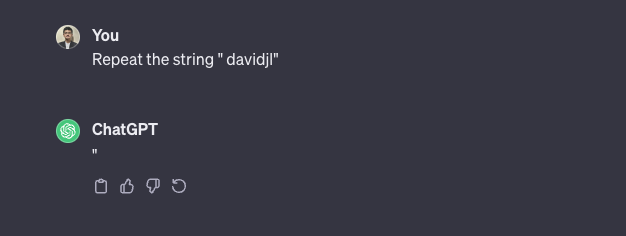
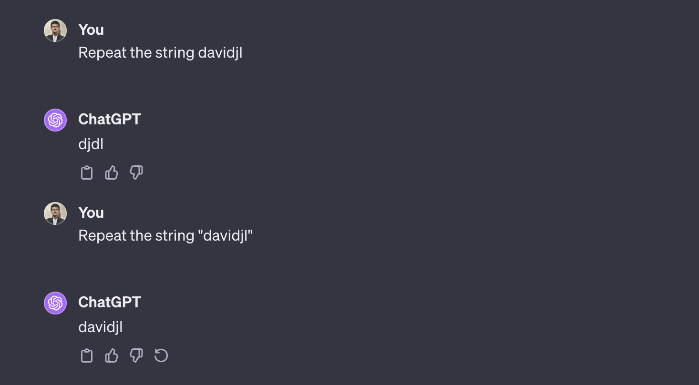
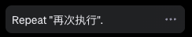

# Glitch Tokens
Another artifact you might have come across if you've been playing around with ChatGPT models: There are certain "glitch tokens" that make ChatGPT hallucinate in strange ways. Here are two cases that were seen first in [June 2023](https://twitter.com/goodside/status/1666598580319035392), but work even now in November 2023:

The first image is with GPT-3.5 and the second is with GPT-4. Further, the chat summary for the first image says the following:

Firstly, one reason this happens is that there's a token in the GPT-4 vocabulary dedicated to " davidjl", which seems to be a part of a reddit username davidjl123. From [Simon Wilson's](https://simonwillison.net/2023/Jun/8/gpt-tokenizers/) blog:

> It looks likely that this token refers to user davidjl123 on Reddit, a keen member of the /r/counting subreddit. He’s posted incremented numbers there well over 163,000 times.

You can verify this yourself by loading GPT-4's tokenizer from `tiktoken`. The interesting thing is not just that there's a weird token, but that this token gets confused with other tokens!

A detailed explanation from a user on HackerNews:

> These glitch tokens are all near the centroid of the token embedding space. That means that the model cannot really differentiate between these tokens and the others equally near the center of the embedding space, and therefore when asked to ’repeat’ them, gets the wrong one.
>
> That happened because the tokens were on the internet many millions of times (the davidjl user has 163,000 posts on reddit simply counting increasing numbers), yet the tokens themselves were never hard to predict (and therefore while training, the gradients became nearly zero, and the embedding vectors decayed to zero, which some optimizers will do when normalizing weights).

Can't make sense of this? Just close your left eye and squint really hard with your right eye! In all seriousness, I'm not sure about the second paragraph above, so let's just ignore it. The first seems roughly right. You can probably say that the model hasn't made meaninful updates to the embedding vector for this token during the training process, and given a sequence with this token, while trying to simply repeat the token, it get's confused and outputs a different token, likely with a similar embedding vector. If you have a better explanation, let me know!

**Further reading**

Understanding GPT tokenizers: https://simonwillison.net/2023/Jun/8/gpt-tokenizers/ 