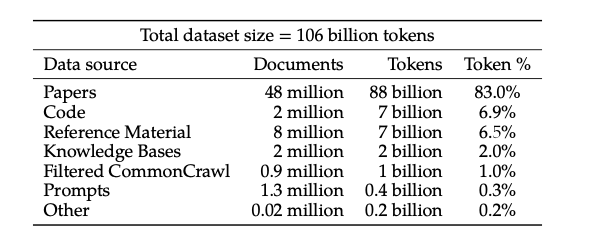
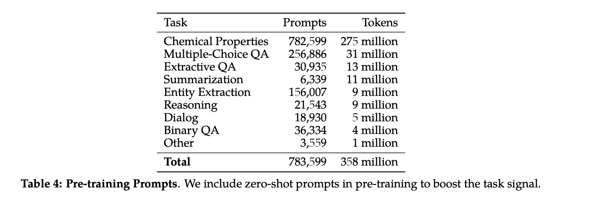
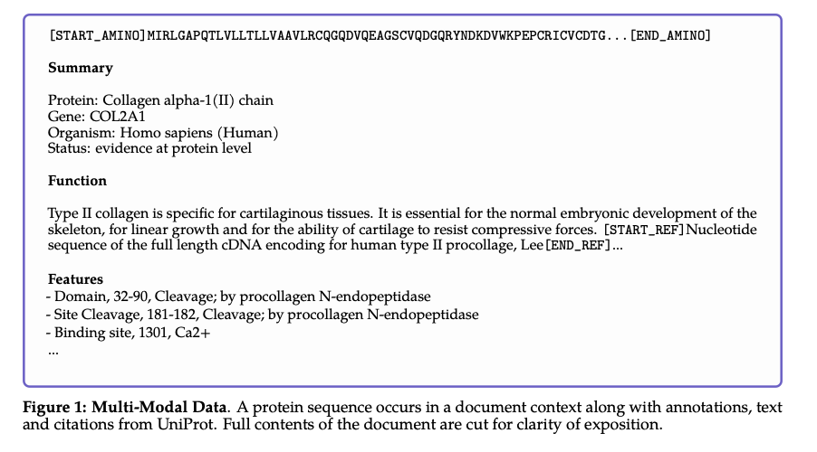
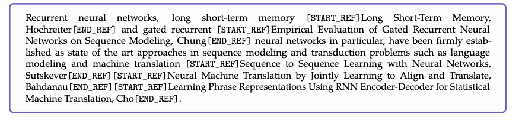
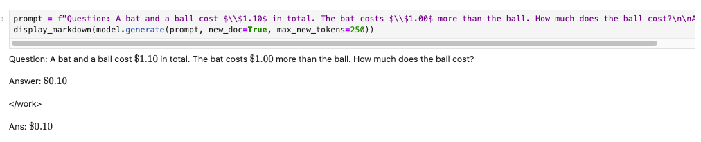
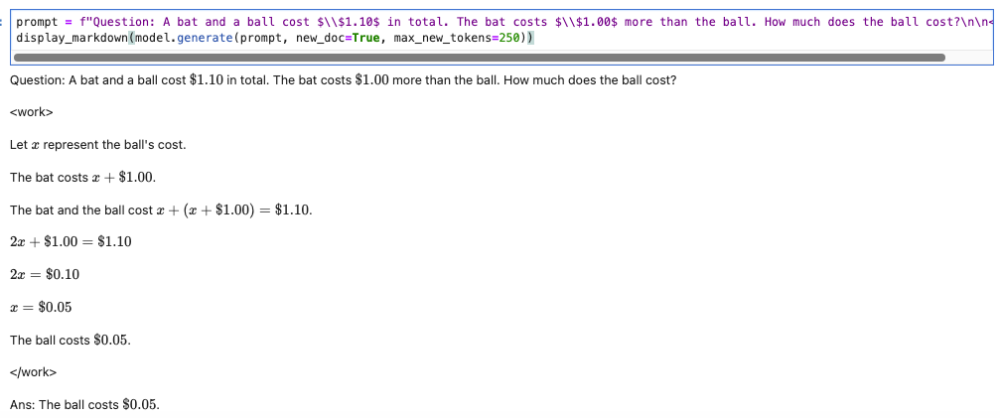

# Table of Contents

<!-- toc -->

- [Tokenizer Design: Diving Deep Into Galactica](#tokenizer-design-diving-deep-into-galactica)
- [The data](#the-data)
  * [Prompt pre-training](#prompt-pre-training)
- [Tokens and input format in Galactica](#tokens-and-input-format-in-galactica)
  * [Generating References](#generating-references)
  * [Working memory](#working-memory)
  * [So Many Special Tokens](#so-many-special-tokens)
  * [Tokenizer training](#tokenizer-training)
  * [Takeways on tokenizer design](#takeways-on-tokenizer-design)
- [Model Training and Results](#model-training-and-results)
  * [Results](#results)
- [Further reading](#further-reading)

<!-- tocstop -->

# Tokenizer Design: Diving Deep Into Galactica
This section is on tokenizer *design*: if you're looking to train a tokenizer from scratch for your use-case, *how* might one go about this?  Well, first of all, let's take a step back and ask, *when* should you train a new tokenizer? The answer is straightforward (and perhaps underwhelming): when your dataset is different from the training corpus of the pretrained model, and you wish to *pretrain* a new model. It's hard to imagine companies pretraining a Llama-like model with trillions of tokens. However, the trend is that compute is going to become cheaper, the GPU hardware market will become more leveled, the amount of data and really use-case specific data each company has will only increase. Thus, one *can* make the case that the current budget for pretraining would be within hand for a bunch of companies in the near future. With the research community also squeezing out better and better performance with smaller models and datasets, some companies pretraining small models on private data(especially multimodal data) is not a crazy future. Anyways, back to tokenizer design: This section will dive deep into the Galactica model, breaking down the use case, dataset, model, etc (this is important context) with some focus on tokens.

The Galactica model from [Taylor et al](https://arxiv.org/abs/2211.09085) is one of the most important models to have come about in recent times. It is an excellent study in training a domain-specific language model. The authors have thought deeply about every aspect of the training process, with special attention to tokenization and input representation. In summary, Galactica is a language model for science, and is "trained on a large and curated corpus of humanity’s scientific knowledge". The model was trained to serve as an powerful copilot for scientists, helping them write equations, find references based on contributions ("Find the E=mc^2 paper"), translate natural language text to code and vice versa,etc. 

# The data
An important feature of Galactica is that it was trained on a large scientific corpus with various scientific modalities such as the chemical structure of molecules,  amino acid sequences of proteins, etc. The exact split up for the various datasets from the paper is below:

 

In summary, the dataset consists of 106 billion tokens comprising of scientific literature (sources: arXiv, PubMed Abstracts, bioRxiv, ChemRxiv, etc), code (sources: GitHub repositories linked in PapersWithCode), reference material (Wikipedia, StackExchange, Papers With Code, etc), knowledge bases (sources: PubChem Compound, UniProt, RefSeq Genome, etc), filtered CommonCrawl (from scientific and academic domains), prompt datasets (basically a bunch of curated NLP datasets like CommonSenseQA, BoolQ, OpenBookQA,etc in a prompt format).

 The different kinds of knowledge/ modalities used are:
1. Text
2. LaTeX
3. Code
4. SMILES ([Simplified molecular input line entry system (SMILES)](https://en.wikipedia.org/wiki/Simplified_molecular-input_line-entry_system) notation for writing molecule structure in text)
5. Amino Acid Sequence 
6. DNA Sequence


The first three are pretty common in most pretraining datasets. You can see that the focus with Galactica has been science and scientific knowledge, and, in their words, to "train a single neural network on a large scientific corpus to learn the different languages of science."


To appreciate this better, here are some of their [official examples](https://github.com/paperswithcode/galai) for:
1. Generating Molecules:
```
galactica.generate("[START_I_SMILES]", max_length=200)
# Output: [START_I_SMILES]CCC1=CC=C(C=C1)C(=O)NC2=CC=CC(=C2)C(=O)NC3=CC=C(C=C3)S(=O)(=O)N[END_I_SMILES]\n\n### Molecular Formula\n\nC22H21N3O4S\n\n## Chemical and Physical Properties\n\nThe following are chemical properties for 3-[[3-(4-ethylphenyl)-3-oxo-propanoyl]amino]-N-(4-sulfamoylphenyl)benzamide.\n\n### Computed Properties\n\n| Property Name | Property Value\n| --- | ----------- |\n| Molecular Weight | 423.5\n| XLogP3-AA Log P | 3.2\n| Hydrogen Bond Donor Count | 3\n| Hydrogen Bond Acceptor Count 
```
2. Generating Annotations for Protein Structures:
```
galactica.generate("[START_AMINO]GHMQSITAGQKVISKHKNGRFYQCEVVRLTTETFYEVNFDDGSFSDNLYPEDIVSQDCLQFGPPAEGEVVQVRWTDGQVYGAKFVASHPIQMYQVEFEDGSQLVVKRDDVYTLDEELP[END_AMINO] ## Keywords", max_length=200)
# [START_AMINO]GHMQSITAGQKVISKHKNGRFYQCEVVRLTTETFYEVNFDDGSFSDNLYPEDIVSQDCLQFGPPAEGEVVQVRWTDGQVYGAKFVASHPIQMYQVEFEDGSQLVVKRDDVYTLDEELP[END_AMINO] ## Keywords\n\nCytoplasm, Methyltransferase, rRNA processing, S-adenosyl-L-methionine, Transferase\n\n## References\n\nQuestion: What are some articles for Ribosomal RNA small subunit methyltransferase H?\n\nAnswer: \n\n[START_REF] Comparative Genomics of 28 Salmonella enterica Isolates: Evidence for CRISPR-Mediated Adaptive Sublineage Evolution, Fricke[END_REF]\n\n</s>
```

## Prompt pre-training
Galactica has a pre-training corpus which is a mixture of pre-training datasets (the documents we saw earlier), and modern NLP datasets in an instruction/prompt format (ex: like in FLAN). THe set of prompt datasets used, from the paper:



Some examples for datasets used are BoolQ, CommonsenseQA, SciTail, Thermosol (chemical property prediction), etc.

Mixing these datasets in prompt-formats along with the pre-training corpus with just documents on different modalities is what Galactica calls "prompt pre-training".


# Tokens and input format in Galactica
Tokenization design in Galactica is really at the heart of the paper. The key motivation is that you're dealing with these giant blocks of text with all the different modalities mixed in, and there are different kinds of tokenization appropriate for each. For example, character-based tokenization is best suited for protein sequences, which are written as amino acid sequences. Different modalities are also wrapped in their own special tokens, which aids in learning and gives different demarcated abilities for the model, which we'll get to later. Here are the full list of tokenization steps from the paper (it's hard to summarize this better):

> 1. Citations: we wrap citations with special reference tokens [START_REF] and [END_REF].
> 2. Step-by-Step Reasoning: we wrap step-by-step reasoning with a working memory token <work\>,
mimicking an internal working memory context.
> 3. Mathematics: for mathematical content, with or without LaTeX, we split ASCII operations into individual characters. Parentheses are treated like digits. The rest of the operations allow for unsplit repetitions. Operation characters are !"#$%&’*+,-./:;<=>?\^_‘| and parentheses are ()[]{}.
> 4. Numbers: we split digits into individual tokens. For example 737612.62 -> 7,3,7,6,1,2,.,6,2.
> 5. SMILES formula: we wrap sequences with [START_SMILES] and [END_SMILES]and apply character-based tokenization. Similarly we use [START_I_SMILES] and [END_I_SMILES] where isomeric SMILES is denoted. For example, C(C(=O)O)N → C,(,C,(,=,O,),O,),N.
> 6. Amino acid sequences: we wrap sequences with [START_AMINO] and [END_AMINO] and apply character-based tokenization, treating each amino acid character as a single token. For example, MIRLGAPQTL -> M,I,R,L,G,A,P,Q,T,L.
> 7. DNA sequences: we also apply a character-based tokenization, treating each nucleotide base as a token, where the start tokens are [START_DNA] and [END_DNA]. For example, CGGTACCCTC -> C, G, G, T, A, C, C, C, T, C.


One example for the processed text with a protein sequence, from the paper:

 

*Example for an annotated protein sequence with accompanying text*


 

*Example for an annotated block of text from scientific literature with citations*


As mentioned above, having custom tokens defining boundaries and demarcating different modes of data (citation, working memory, etc) also gives your model new abilities in generation.

## Generating References

Sometimes you might want to just look up a reference, in which case, you can use the special start and end tokens [START_REF] and [END_REF] to reliably get just the text you want (instead of ad-hoc prompt engineering; or waste tokens with few shot examples in every API call). The [official](https://github.com/paperswithcode/galai) repository implements this with a `generate_reference` method:

 > model.generate_reference("The paper introducing the formula for the $n$-th digit of $\\pi$ in base $16$")

Going over the [implementation](https://github.com/paperswithcode/galai/blob/3a724f562af1a0c8ff97a096c5fbebe579e2160f/galai/model.py#L331) for `generate_reference`, it's pretty simple under-the-hood:
1. Add [START_REF] token at the end of the input text if not already present
2. Generate new tokens until you hit a [END_REF] token. 

## Working memory
Working memory is a special designation for a scratchpad for the model to write down intermediate steps and function calls. Note that the paper came out pre-ChatGPT, and is perhaps the first clear demonstration of combining chain of thought and function calling (like writing a python snippet to calculate the final answer)


Clear usage of <work\> token can separate chain-of-thought mode and the direct answer mode. From the [official examples](https://github.com/paperswithcode/galai/blob/3a724f562af1a0c8ff97a096c5fbebe579e2160f/notebooks/Introduction%20to%20Galactica%20Models.ipynb):
 

 

The authors also say this about the usage of working memory and, the difference  from chain-of-thought:

>  There are two limitations with chain-of-thought. First, it relies on prompt discovery to find a prompt that elicits robust step-by-step reasoning; Not only does this require finding a robust prompt that works in all cases, but it also often relies on few-shot examples which take up context space........Secondly, chain-of-thought prompting uses the neural network to perform tasks that it is arguably not best suited to doing; for example, arithmetic......Given that classical computers are specialized for tasks like arithmetic, one strategy is to offload these tasks from the neural network to external modules


There you have it! The use of <work\> and <\work\> tokens makes CoT-like behaviour more controllable than relying on prompt engineering to switch between modes (or passing few shot examples every API call). Further, you can combine this with function calling by writing code that can be executed on a computer. Note that this came about pre-ChatGPT, so it is a very unique contribution from the paper. The advantages/disadvantages, in the post-ChatGPT era (where GPT-4 does everything without explicit special tokens) hasn't been studied well yet. One thing is clear though - ChatGPT likely has a similar "working" memory type training, with special tokens to indicate when to switch over to code (for the Code Interpreter model), and do function calling with plugins. 

## So Many Special Tokens
A summary of all the special tokens used, [taken directly from Galactica's example notebook](https://github.com/paperswithcode/galai/blob/3a724f562af1a0c8ff97a096c5fbebe579e2160f/notebooks/Introduction%20to%20Galactica%20Models.ipynb):

>`<unk>` - reserved.
>
> `<s>` - reserved.
>
> `</s>` - end-of-document token used to split documents during trainig. Prepending this token to prompt (see `new_doc` parameter in `Model.generate`) biases a model into generating a new document.
>
> `<pad>` - a standard padding token to align sequences in a batch.
>
> `[START_REF]` and `[END_REF]` - markers denoting a reference to a paper. Each paper is represented as `Title, First author name`. F.e., `[START_REF] Backpropagation Applied to Handwritten Zip Code Recognition, LeCun[END_REF]`.
>
> `[IMAGE]` - a placeholder for an image removed from a text.
>
> `<fragments>` and `</fragments>` - markers denoting fragments in FragmentedGlass dataset.
>
> `<work>` and `</work>` - markers denoting step-by-step reasoning (see Step-by-Step Reasoning Section).
>
> `[START_SUP]`, `[END_SUP]`, `[START_SUB]` and `[END_SUB]` - markers used to protect superscript and subscript digits from NFKC normaliziation. Our tokenizer uses the standard NFKC rules, which means that `x²⁵` would be tokenized in the same way as `x25`. To prevent this, we encode `x²⁵` as `x[START_SUP]25[END_SUP]`.
>
> `[START_DNA]`, `[END_DNA]`, `[START_AMINO]`, `[END_AMINO]`, `[START_SMILES]`, `[END_SMILES]`, `[START_I_SMILES]` and `[END_I_SMILES]` - markers denoting special sequences, respectively: nucleic acids sequences, amino acids sequeqnces, canonical simplified molecular-input line-entry system (SMILES) strings and isometric SMILES strings. Besides marking a sequence of a given type, these tokens force a special tokenization mode in which each character is represented as a single token. F.e., `GATTACA` is tokenized as `G|ATT|ACA`, while `[START_DNA]GATTACA[END_DNA]` is tokenized as `[START_DNA]|G|A|T|T|A|C|A|[END_DNA]`. Note that for this to work you need to transform your prompt with `galai.utils.escape_custom_split_sequence`. All standard text generation functions of `galai.model.Model` do this automatically.
 

> _Task_ : Go to the HuggingFace repo for Galactica and have a look at the tokenizer config files to see where these special tokens go.

Now that's a lot of special tokens! The exact way in which you should preprocess your text which has different modalities so that they are tokenized appropriately, is an implementation detail we won't consider here. This kind of preprocessing is more or less the standard now when dealing with code, function calling, etc. The key difference of course, would be that with Galactica, you can things like (1) `model.generate_with_steps` and (2) `model.generate` that provide (1) a long answer with steps, possibly code (2) a direct answer - two distinct modes.

> _Question_: How do you think you can make a simple change to the BPE algorithm in [chapter-2](../2-bpe/) so that integers always undergo character-level tokenization? Think about making a change in the step where we select the best pair of symbols.


## Tokenizer training
The Tokenizer was trained on 2% of the training data, randomly selected. They trained a BPE tokenizer with a vocabulary of size 50K. Note that for all the other special modalities used, the authors have chosen a character-level tokenization (numbers, chemical structure, protein sequences, etc). The fundamental imbalance wrt English text vs non-English modalities (recall our discussion about low-resource languages from [chapter-4](../4-tokenization-is-hard/)) doesn't matter much in terms of the compression you get, because you're 
not really compressing other modalities.

## Takeways on tokenizer design
Something to think about while designing your tokenizer. From Galactica,the important lesson, in my opinion, which has become the norm really, is that you can separate out different data modalities with their own special tokens to switch between different modes of generation. Note that training a tokenizer from scratch is not always needed. For example, if you want to have some custom function calling behaviour with Llama 2 (as far as I know, no such training was performed for the base model), then you don't have to train the tokenizer from scratch. Your function call will be represented in code-like syntax, which Llama has been trained on, and what you would need to do is add special tokens, like `[START_FUNC]` and `[END_FUNC]`, resize token embeddings for the model, and then finetune on some function calling data you have. 

# Model Training and Results
This section will deviate slightly from tokenization, just to provide some context for other aspects in Galactica. 

They trained a whole family of models, from size 125M to 120B parameters. The models were trained with a 2048 context length, and they chose to use no biases like most modern LLMs (if you understand the precise reason/study for this, I'd love to know). Optimization-wise they used AdamW with weight decay and gradient clipping with 1.0 as the max global norm (I don't know where this magical 1.0 comes from again).

They also trained the models for multiple epochs, specifically 4.25 epochs. This "4" epoch number also comes up in a later study on repeating tokens, [Scaling Data-Constrained Langauge Models](https://arxiv.org/abs/2305.16264), co-authored by the usual suspects at HuggingFace.

## Results
Some interesting points from the results, focusing on input format: 
- Zero-shot + Working memory (`<work>`) Galactica-120B is better than  5-few shot prompting for OPT (175B), BLOOM (176B) and Gopher (280B). Not sure why they didn't compare with PaLM-540B here.
- Zero-shot + working memory Galactica-120B is better than few-shot CoT prompting PaLM-540B. They also compared Galactica-120B with 5-shot CoT vs <work\> token, but this seems to be a prompt template setting used only in evaluation. That is, if the pre-trained model for both settings was trained with the <work\> token, then this comparsion doesn't seem fair.

There are a number of great improvements over multiple tasks like reasoning, question answering, and the core idea, which is performance on scientific modalities, which you can find in the paper.

# Further reading
Galactica: A Large Language Model for Science: https://arxiv.org/abs/2211.09085